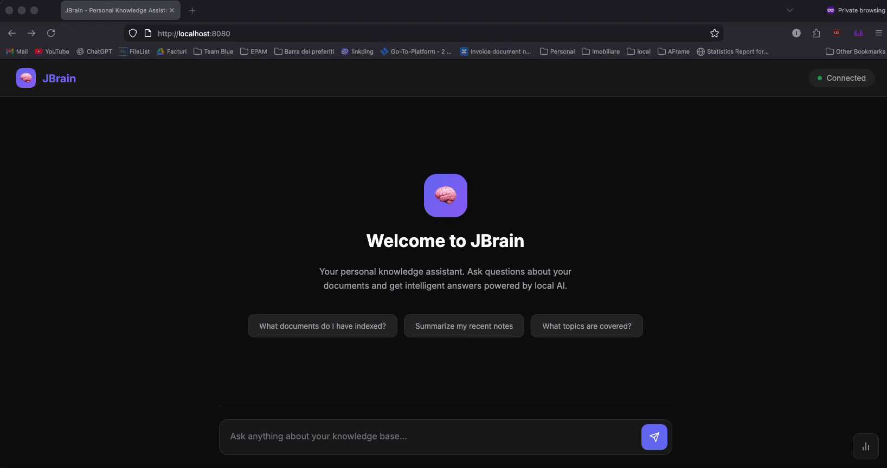
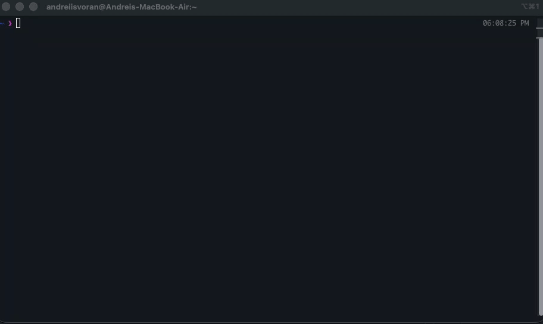

# JBrain - Personal Knowledge Assistant

A Spring Boot application that indexes your local Markdown and Text files into a vector store and allows you to query them using natural language. Powered by Spring AI and Ollama for local LLM support.






## Features

- **CLI Tool**: Query your knowledge base from the terminal with `brain <question>` - streaming responses
- **Beautiful Web UI**: Modern, dark-themed chat interface for asking questions
- **Document Ingestion**: Automatically scans and indexes `.md`, `.txt`, and `.markdown` files
- **Vector Store Persistence**: Uses `SimpleVectorStore` with JSON file persistence
- **Auto-Update**: Watches for file changes and automatically re-indexes modified documents
- **RAG (Retrieval-Augmented Generation)**: Queries your knowledge base and generates contextual answers
- **Source Citations**: See which documents were used to generate each answer
- **Local LLM**: Uses Ollama for embeddings and chat completions (no API keys required)

## Prerequisites

### 1. Java 25+

Ensure you have Java 25 or later installed:

```bash
java -version
```

### 2. Ollama

Install Ollama from [ollama.ai](https://ollama.ai) and pull the required models:

```bash
# Install the chat model
ollama pull llama3.2

# Install the embedding model
ollama pull nomic-embed-text
```

Verify Ollama is running:

```bash
curl http://localhost:11434/api/tags
```

### 3. Create Knowledge Directory

Create the directory where you'll store your documents:

```bash
mkdir -p ~/knowledge
```

## Quick Start

### 1. Build and Run

```bash
./gradlew bootRun
```

### 2. Open the Web UI

Navigate to **http://localhost:8080** in your browser to access the chat interface.

### 3. Add Documents

Place your Markdown or text files in `~/knowledge`:

```bash
# Example: Create a sample document
cat > ~/knowledge/spring-boot-notes.md << 'EOF'
# Spring Boot Notes

## Key Features
- Auto-configuration
- Embedded servers
- Production-ready features

## Best Practices
- Use constructor injection
- Keep configuration in application.yml
- Use profiles for different environments
EOF
```

The application automatically detects new files and indexes them.

### 4. Query Your Knowledge Base

Use the CLI tool, web interface, or REST API:

```bash
# Using the CLI (recommended - streams response)
./brain what are the key features of Spring Boot

# Or use the REST API
curl -X POST http://localhost:8080/api/ask \
  -H "Content-Type: application/json" \
  -d '{"question": "What are the key features of Spring Boot?"}'
```

## Web Interface

JBrain includes a beautiful, modern web interface for interacting with your knowledge base.

### Features

- **Chat Interface**: Conversational UI for asking questions naturally
- **Source Citations**: Click on source tags to see which documents were used
- **Real-time Status**: Connection status indicator shows if the server is online
- **Statistics Panel**: View indexed file count and trigger re-indexing
- **Dark Theme**: Easy on the eyes for extended use
- **Responsive Design**: Works on desktop and mobile devices

### Screenshots

Access the UI at `http://localhost:8080` after starting the application.

The interface includes:
- Welcome screen with suggested questions to get started
- Chat history showing your questions and JBrain's responses
- Source documents cited for each answer
- Statistics panel (click the chart icon in the bottom right)

## CLI Tool

JBrain includes a `brain` command-line tool for querying your knowledge base directly from the terminal with streaming responses.

### Usage

```bash
# Ask a question (words are joined automatically)
./brain what are the best practices for spring boot

# Or use quotes for complex questions
./brain "how do I configure logging?"

# Use a specific model for complex questions
./brain --model llama3.1:70b "explain quantum computing in detail"
./brain -m mistral what is dependency injection

# List available models
./brain --models
```

### Global Installation

To use `brain` from anywhere in your terminal (like `curl` or `git`):

**Option 1: Symlink (Recommended)**

Run this from the jbrain project directory:

```bash
sudo ln -s "$(pwd)/brain" /usr/local/bin/brain
```

**Option 2: Add to PATH**

Add this line to your shell config (`~/.zshrc` or `~/.bashrc`):

```bash
export PATH="$PATH:/path/to/jbrain"
```

Then reload your shell:

```bash
source ~/.zshrc  # or source ~/.bashrc
```

After installation, use it from any directory:

```bash
brain what are the key features of Spring Boot
brain how do I configure logging
```

### Configuration

The CLI uses environment variables for configuration:

| Variable | Default | Description |
|----------|---------|-------------|
| `JBRAIN_HOST` | `localhost` | JBrain server host |
| `JBRAIN_PORT` | `8080` | JBrain server port |

Example with custom server:

```bash
JBRAIN_HOST=192.168.1.100 brain what is RAG
```

### Model Switching

Switch between different Ollama models on the fly for different use cases:

```bash
# List all available models
brain --models

# Use a larger model for complex questions
brain --model llama3.1:70b "explain the theory of relativity"

# Use a faster model for quick queries
brain -m qwen2:1.5b "what is a variable"

```

**Tips:**
- Larger models (7B+) are better for complex reasoning but slower
- Smaller models (1.5B-3B) are faster for simple queries
- Use `brain --models` to see available models and their sizes

### How It Works

1. The CLI sends your question to the `/api/ask/stream` endpoint
2. The server streams tokens back as Server-Sent Events (SSE)
3. Tokens are displayed in real-time as they're generated
4. The response streams directly to your terminal

## API Reference

### Ask a Question (POST)

**Endpoint**: `POST /api/ask`

**Request Body**:
```json
{
  "question": "Your question here"
}
```

**Response**:
```json
{
  "answer": "The LLM's response based on your knowledge base...",
  "sources": [
    {
      "filename": "spring-boot-notes.md",
      "path": "/Users/you/knowledge/spring-boot-notes.md",
      "preview": "First 200 characters of the matching content..."
    }
  ],
  "originalQuestion": "Your question here"
}
```

**Example**:
```bash
curl -X POST http://localhost:8080/api/ask \
  -H "Content-Type: application/json" \
  -d '{"question": "What are best practices for Spring Boot?"}'
```

### Ask a Question (GET)

**Endpoint**: `GET /api/ask?q={question}`

**Example**:
```bash
curl "http://localhost:8080/api/ask?q=How%20do%20I%20configure%20profiles?"
```

### Ask a Question (Streaming)

**Endpoint**: `GET /api/ask/stream?q={question}&model={model}`

Streams the response as Server-Sent Events (SSE). Used by the CLI tool for real-time output.

**Parameters**:
- `q` (required): The question to ask
- `model` (optional): Override the default model (e.g., `llama3.2`, `mistral`, `qwen2:7b`)

**Example**:
```bash
# Use default model
curl -N "http://localhost:8080/api/ask/stream?q=What%20is%20dependency%20injection"

# Use a specific model
curl -N "http://localhost:8080/api/ask/stream?q=Explain%20quantum%20computing&model=llama3.1:70b"
```

### List Available Models

**Endpoint**: `GET /api/models`

Returns the list of available Ollama models and the current default model.

**Example**:
```bash
curl http://localhost:8080/api/models
```

**Response**:
```json
{
  "defaultModel": "qwen2:1.5b",
  "available": [
    {
      "name": "llama3.2:latest",
      "family": "llama",
      "parameterSize": "3.2B",
      "sizeBytes": 2019393189
    },
    {
      "name": "qwen2:1.5b",
      "family": "qwen2",
      "parameterSize": "1.5B",
      "sizeBytes": 934954752
    }
  ]
}
```

### Search Without LLM

Performs similarity search and returns matching documents without generating an LLM response. Useful for debugging or exploring what documents match a query.

**Endpoint**: `GET /api/search?q={query}&topK={number}`

**Parameters**:
- `q` (required): Search query
- `topK` (optional, default: 5): Number of results to return

**Example**:
```bash
curl "http://localhost:8080/api/search?q=configuration&topK=3"
```

### Trigger Manual Re-indexing

**Endpoint**: `POST /api/ingest`

Forces a full re-scan and re-indexing of all documents.

**Example**:
```bash
curl -X POST http://localhost:8080/api/ingest
```

**Response**:
```json
{
  "status": "completed",
  "documentsProcessed": 15
}
```

### View Statistics

**Endpoint**: `GET /api/stats`

**Example**:
```bash
curl http://localhost:8080/api/stats
```

**Response**:
```json
{
  "indexedFileCount": 15,
  "documentsPath": "/Users/you/knowledge",
  "fileWatcherActive": true
}
```

### Health Check

**Endpoint**: `GET /api/health`

**Example**:
```bash
curl http://localhost:8080/api/health
```

## Configuration

All configuration is in `src/main/resources/application.yml`:

```yaml
spring:
  ai:
    ollama:
      base-url: http://localhost:11434
      chat:
        model: llama3.2              # Chat model for generating responses
        options:
          temperature: 0.7           # Creativity (0.0 = deterministic, 1.0 = creative)
          num-predict: 1024          # Max tokens in response
      embedding:
        model: nomic-embed-text      # Embedding model for vectorization

jbrain:
  knowledge:
    documents-path: ${user.home}/knowledge           # Where your documents live
    vector-store-path: ${user.home}/.jbrain/vector-store.json  # Persistence file
    chunk-size: 1000                 # Tokens per chunk
    chunk-overlap: 200               # Overlap between chunks
    similarity-top-k: 5              # Documents to retrieve for context
    file-extensions:                 # File types to index
      - .md
      - .txt
      - .markdown

server:
  port: 8080
```

### Environment Variable Overrides

You can override any configuration using environment variables:

```bash
# Change documents path
export JBRAIN_KNOWLEDGE_DOCUMENTS_PATH=/path/to/your/docs

# Change LLM model
export SPRING_AI_OLLAMA_CHAT_MODEL=mistral
```

## How It Works

1. **Startup**: On application start, all documents in the configured directory are scanned and indexed
2. **Chunking**: Large documents are split into smaller chunks using `TokenTextSplitter`
3. **Embedding**: Each chunk is converted to a vector using `nomic-embed-text`
4. **Storage**: Vectors are stored in `SimpleVectorStore` and persisted to JSON
5. **Watching**: A file watcher monitors for new/modified files and triggers re-indexing
6. **Querying**: When you ask a question:
   - Your question is converted to a vector
   - Similar document chunks are retrieved from the vector store
   - The chunks are used as context in a system prompt
   - The LLM generates a response based on the context

## Supported File Types

| Extension | Type |
|-----------|------|
| `.md` | Markdown |
| `.markdown` | Markdown |
| `.txt` | Plain text |

## Troubleshooting

### "Connection refused" to Ollama

Ensure Ollama is running:

```bash
ollama serve
```

### Empty responses

Check that your knowledge directory has documents:

```bash
ls -la ~/knowledge/
```

Verify documents were indexed:

```bash
curl http://localhost:8080/api/stats
```

### Slow responses

Large documents or many files can slow down initial indexing. The first query after startup may also be slow as the LLM loads into memory. Subsequent queries will be faster.

### Out of memory

If you have many documents, increase the JVM heap:

```bash
JAVA_OPTS="-Xmx4g" ./gradlew bootRun
```

## Using Different Models

### Smaller/Faster Models

```yaml
spring:
  ai:
    ollama:
      chat:
        model: phi3           # Smaller, faster
      embedding:
        model: all-minilm     # Smaller embedding model
```

### Larger/Smarter Models

```yaml
spring:
  ai:
    ollama:
      chat:
        model: llama3.1:70b   # Much larger, requires significant RAM
```

## Development

### Build

```bash
./gradlew build
```

### Run Tests

```bash
./gradlew test
```

### Create Executable JAR

```bash
./gradlew bootJar
java -jar build/libs/jbrain-0.0.1-SNAPSHOT.jar
```

## Docker Deployment

Run JBrain with Docker Compose (includes Ollama):

### Quick Start with Docker

```bash
# 1. Add your documents to the knowledge folder
cp ~/your-notes/*.md ./knowledge/

# 2. Start everything (first run will download models ~2GB)
docker compose up -d

# 3. Wait for models to download (check logs)
docker compose logs -f ollama-init

# 4. Access the UI
open http://localhost:8080
```

### Docker Commands

```bash
# Start services
docker compose up -d

# View logs
docker compose logs -f jbrain

# Stop services
docker compose down

# Rebuild after code changes
docker compose build --no-cache jbrain
docker compose up -d

# Remove everything (including volumes)
docker compose down -v
```

### GPU Support (NVIDIA)

For faster inference, uncomment the GPU section in `docker-compose.yml`:

```yaml
deploy:
  resources:
    reservations:
      devices:
        - driver: nvidia
          count: all
          capabilities: [gpu]
```

### Docker Environment Variables

| Variable | Default | Description |
|----------|---------|-------------|
| `SPRING_AI_OLLAMA_CHAT_MODEL` | `llama3.2` | Chat model to use |
| `SPRING_AI_OLLAMA_EMBEDDING_MODEL` | `nomic-embed-text` | Embedding model |
| `JBRAIN_KNOWLEDGE_SIMILARITY_TOP_K` | `3` | Documents to retrieve |
| `JAVA_OPTS` | `-Xmx512m` | JVM memory settings |

## Tech Stack

- **Spring Boot 4.0.2** - Application framework
- **Spring AI 2.0.0-M1** - AI/ML integration
- **Ollama** - Local LLM runtime
- **SimpleVectorStore** - In-memory vector storage with JSON persistence
- **Java 25** - Runtime
- **Docker** - Containerization

## License

MIT
